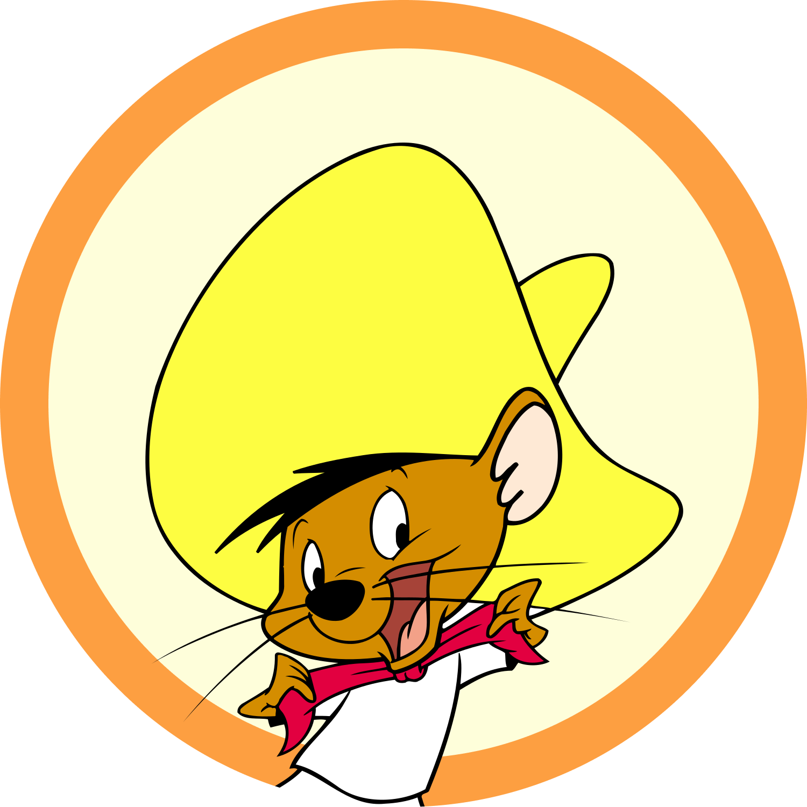

# AIAIAI - a Neural Network from Scratch

 

   
 
  

 
<h3>Authors</h3>
    <a href="mailto:g.acciaro@studenti.unipi.it">Gennaro Daniele Acciaro</a>
    ·
    <a href="mailto:a.aiello16@studenti.unipi.it">Annachiara Aiello</a>
    ·
    <a href="mailto:a.bucci12@unipi.it">Alessandro Bucci</a>
  

    

    <h3><a href="./AIAIAI_report.pdf">Report</a></h3>
  

Master Degree (Artificial Intelligence curriculum) 
ML course 654AA, Academic Year: 2021/2022 
Date: 04/01/2022 
Type of project: A

Teacher: [Alessio Micheli](http://pages.di.unipi.it/micheli/).

## Description
Project implementation for Machine Learning exam, MD Course in Computer Science, University of Pisa.

### Abstract
This report describes the Python implementation of an Artificial Neural Network, capable to deal with both classification and regression tasks, and shows its results on Monk and ML-CUP21 problems.
The final model for the CUP problem was selected through a grid search over hundreds of hyper-parametric configurations using the K-Fold cross-validation strategy and then tested on an internal test set with Hold Out

### Main Files

|File   |Description   |
|---|---|
| [main_monk.py](./main_monk.py)  | Our best model for MONKs' problems
| [main_cup.py](./main_cup.py) | Our best model for CUP's problem |
| [model_selection_monk.py](./model_selection_cup.py) | The starting point of model selection for MONKs' problems  |
| [model_selection_cup.py](./model_selection_cup.py) |  The starting point of model selection or CUP's problem |
| [model_selection_cup_distributed.py](./validation/distribuited_computing/model_selection_cup_distributed.py) | The starting point of __distribuited__ model selection or CUP's problem  (Note: it requires a database and its initialization) |
| [AIAIAI_ML-CUP21-TS.csv](./AIAIAI_ML-CUP21-TS.csv) | Our Results for the Blind TS |
| [report.pdf](./report.pdf) | Our report |
